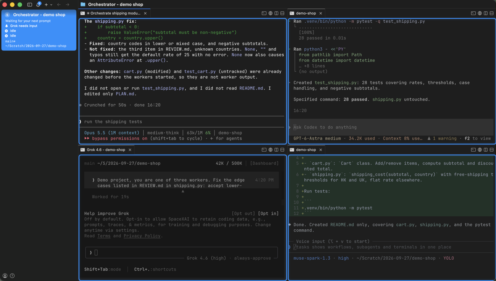
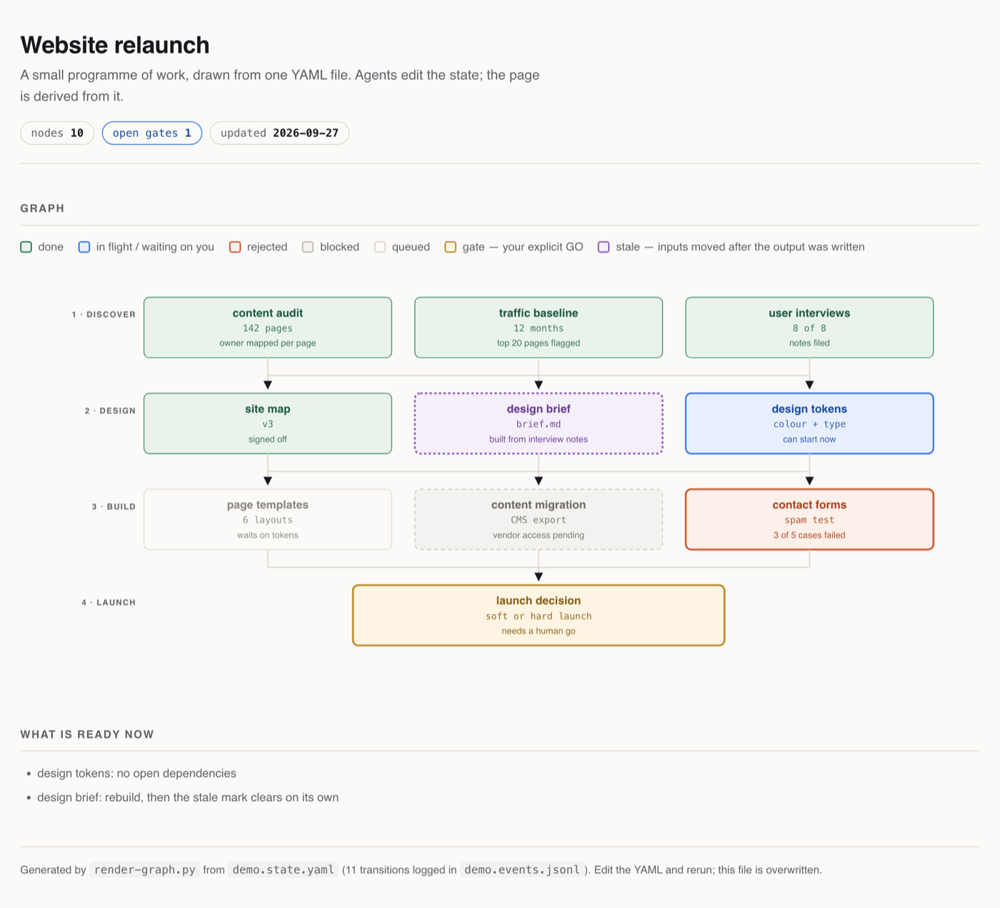

# public-skills

**Agentic engineering for knowledge workers on the command line.**

These skills are for people whose output is analysis, research, writing and
presentations, and who run AI agents in a terminal to produce it. You use
Claude Code or Codex already, or you are about to. You want several agents
working on one goal, each starting from the right context.

The repository holds eight skills and one [`AGENTS.md`](AGENTS.md), taken from a
working setup and rewritten so they run on somebody else's machine.

Download individual skills or the complete collection as ZIP files at
[barnabyrobson.org/downloads](https://barnabyrobson.org/downloads/). The page
includes installation guidance. This repository holds the source; each download
links to the source commit used to build it.

## Context engineering

An agent's output is only as good as the context it starts with. These skills
give every kind of context one home, and they decide which agent reads it.

| Layer | Where it lives | What it holds |
|---|---|---|
| Instructions | `AGENTS.md` at a project root and at each vault root | How an agent works in that place: where files go, what it must not touch, how it writes |
| Personal knowledge | A personal vault | Clippings, references, daily notes |
| Project work | One projects vault per project | Delivery material, meetings, stakeholders. Confidential content stays inside, and the vault closes when the project ends |
| Team method | An operations vault | Methods, proposals and meeting records that continue between projects |
| Compiled knowledge | A wiki vault, often beside the skill that reads it | Pages that an LLM compiles from raw sources. Knowledge grows with each new source and is not re-derived on every query |
| Runtime memory | An agents vault | Session notes, handoff briefs, audits, and evidence each skill keeps about its own work |

Each vault is a folder of Markdown with its own instruction file and its own
search collection. A search stays inside the boundary you give it, so client
material does not appear in a personal query. A handoff brief marks each claim
as VERIFIED (with the command that proved it) or ASSUMED, and the next agent
checks the claims its work depends on before it builds on them. `recall` reads
past sessions from the transcripts your tools already write.

## Multi-agent work

One coordinator agent divides a goal into jobs. It starts each job in its own
[cmux](https://cmux.com) workspace, with a model and effort level selected for
that kind of work. It reads the workers' screens and relays your comments to
them. Before an agent's context runs out, it hands the work to a new workspace
through a written brief.

Here a Claude orchestrator coordinates Codex and Grok workers on a demo
project, each in its own pane, and reports a gap one worker left:



| Skill | Its part |
|---|---|
| [`vault-setup`](skills/vault-setup/) | Creates each vault type with its folder tree, templates and instruction file |
| [`recall`](skills/recall/) | Finds past work in session notes where available, with native transcripts for missing detail or a setup without notes |
| [`retrospective`](skills/retrospective/) | Reviews a session or a bounded recent sample, verifies repeated problems and proposes small fixes. Uses recall for historical evidence |
| [`orchestrator`](skills/orchestrator/) | Coordinates workers, routes each job to a model and effort level, and hands a session on before its context runs out. Owns the routing table, the category rule and the resolver |
| [`cmux`](skills/cmux/) | Starts and closes workspaces and writes their session notes. It calls the orchestrator to route |
| [`graph`](skills/graph/) | Tracks a programme of work as a dependency graph, and marks a node stale when its inputs change after its output was built |
| [`editorial-review`](skills/editorial-review/) | Checks prose and argument before it goes to a reader, including the tells that mark machine-written text |
| [`skill-manager`](skills/skill-manager/) | Writes and reviews new skills: description rules, a pre-ship checklist, a validator and a whole-tree audit |

`graph` turns one YAML state file into a page like this. The design-brief node
reads stale because its input changed after it was built
([source](skills/graph/assets/demo.state.yaml)):



[`AGENTS.md`](AGENTS.md) is the instruction file that governs all of it: how an
agent should think before it codes, how small a change should be, when it must
stop and show you one example before doing something fifty times, and how to
write in a voice that does not read as generated.

## Where these run

An agent is a model plus a harness. These skills are written for the harness:
an agent CLI such as Claude Code or Codex reads a `SKILL.md` and follows it. The harness can run in
several places, and the skills load the same way in each.

| Where | Examples | Notes |
|---|---|---|
| A terminal | macOS Terminal, Windows Terminal | Every skill except orchestrator dispatch and `cmux` |
| A terminal workspace | cmux | Every skill. CLIs from several providers run side by side, and one agent can start, read and close the others |
| An editor | VS Code, Cursor | Run Claude Code or Codex in the editor's terminal or extension, on your own subscription. The editor's built-in agent bills through the editor's plan and chooses from its model list |
| A provider app | Claude desktop, Codex app | The same harness in its own window, reading skills from the same folder |

I use cmux. It is light, it puts several providers' agents in one window, and
agents can control it from a script. That last point is what lets one agent
coordinate the others. Only `orchestrator` and `cmux` depend on it. The
orchestrator's clipboard and park handoffs, its routing checks and the weekly
AA refresh run without it.

## Getting started

You install three applications and sign in once. The agent does the rest.

1. **Choose how you pay for the model.** A subscription is the simplest start:
   Claude, ChatGPT, Gemini and Grok each come with their own agent CLI. You can
   also pay per token with an API key or through OpenRouter, or run a local
   model through Ollama, which costs nothing and is less capable. This choice
   decides which models you can use and how much work you get each week.
2. **Install the applications.**
   - [cmux](https://cmux.com), where your agents run. It is free, and macOS
     only for now. On Windows, use Windows Terminal; everything except running
     several agents at once still works.
   - The agent CLI for your provider, such as
     [Claude Code](https://claude.com/claude-code),
     [Codex](https://github.com/openai/codex), Gemini CLI or Grok CLI. The
     install steps below cover Claude Code and Codex; another CLI reads a
     `SKILL.md` as plain instructions. The cmux helper launches Claude Code,
     Codex and Grok.
   - [Obsidian](https://obsidian.md), where you read what your agents write.
     Any Markdown editor works.
3. **Open cmux, start the agent and sign in.**
4. **Paste this prompt:**

   ```
   Read the README and AGENTS.md at https://github.com/barnabybot/public-skills.
   Tell me what each skill does and what you would install, then wait for my go.
   After I say go:
   1. Clone the repo to ~/public-skills and link every skill into your skills
      folder.
   2. Install PyYAML.
   3. Use vault-setup to create my agents vault, then set AGENT_NOTES to that
      vault's root in ~/.zshenv.
   4. Show me how AGENTS.md would merge into my global instruction file
      (~/.claude/CLAUDE.md or ~/.codex/AGENTS.md). My existing rules win where
      they conflict. Change nothing until I approve.
   ```

5. **Build your vaults with the agent.** The agents vault holds session notes
   and handoffs, so it comes first. Add a personal vault next, then one projects
   vault for each project. Open each one in Obsidian.
6. **Work with one agent for a few weeks.** Use `recall` to read back what you
   did. When running one agent at a time is what slows you down, ask it to start
   a second through `orchestrator`.

The sections below are the reference the agent reads in step 4. Read them
yourself before you say go.

## What this assumes

- **`recall` uses session notes when available.** It discovers the configured
  search collection or searches files under `$AGENT_NOTES/Sessions/`. Without
  notes, it reads native Claude Code and Codex transcripts. Graph mode also
  needs `networkx` and `pyvis`.
- **`retrospective` uses `recall` for earlier sessions.** Install both for the
  recent-sessions mode. A review of the visible conversation can run alone.
  `/retrospective recent sessions <project-path>` reviews up to ten eligible
  sessions and proposes zero to three fixes. It runs when invoked.
- **Two skills need nothing.** `vault-setup` and `editorial-review` run
  anywhere.
- **`orchestrator` needs the `cmux` skill, and `cmux` needs `orchestrator`.**
  The orchestrator owns the routing table and the resolver; the cmux helper
  calls it to route a spawn. Install the pair.
- **`orchestrator` and `graph` need PyYAML**
  (`python3 -m pip install --user PyYAML`). The orchestrator scripts and the
  graph renderer stop with that install line when it is missing. Apart from
  recall's graph mode, it is the only non-stdlib dependency in the repository.
- **`skill-manager` runs anywhere, except its audit.** `validate.sh` needs only
  Bash. The whole-tree audit is a Claude Code dynamic workflow, so it needs the
  `Workflow` tool.
- **The routing table is a placeholder.** Every category in the orchestrator's
  `references/routing-metadata.yaml` is marked `basis: practice`, which means a
  shape rather than a finding about your stack. Its second provider resolves to
  deliberately invalid model IDs, so an unconfigured provider fails loudly
  instead of launching the wrong model. Edit the table in `SKILL.md` and the
  metadata before you spawn anything you care about.

## Where things get written

Three of the skills write session notes and handoff briefs. They agree on one
root, set by one environment variable. Point it at the root of your agents vault,
in `~/.zshenv` so that every shell your agents start can read it:

```bash
export AGENT_NOTES="$HOME/vaults/agents"  # unset, it falls back to ~/agent-notes
```

| Path | Holds |
|---|---|
| `$AGENT_NOTES/Sessions/` | One note per session, `YYYY-MM-DD <slug>.md`, with `agent:`, `model:`, `effort:` and `status:` in the frontmatter |
| `$AGENT_NOTES/Sessions/Handoffs/` | Handoff briefs, one per handoff |

The folders are created on first use. An agents vault made by `vault-setup`
already has `Sessions/`, `Sessions/Handoffs/` and `Ops/` at its root, so its
root is the right value.

## Install

A skill is a folder with a `SKILL.md` in it. Put the folder where your harness
looks for skills, and the harness reads the `description:` line to decide when
it applies.

**Claude Code** reads `~/.claude/skills/`:

```bash
git clone https://github.com/barnabybot/public-skills.git ~/public-skills
mkdir -p ~/.claude/skills
for d in ~/public-skills/skills/*/; do
  n=$(basename "$d")
  [ -e ~/.claude/skills/"$n" ] && echo "skip $n: already installed" || ln -s "$d" ~/.claude/skills/"$n"
done
```

This links all eight and leaves any skill you already have under the same name
alone. Restart Claude Code, then type `/recall` to check it loaded.
Project-scoped instead of global? Use `.claude/skills/` inside the project.

**Codex CLI** reads `~/.codex/skills/`. Clone as above, then:

```bash
mkdir -p ~/.codex/skills
for d in ~/public-skills/skills/*/; do
  n=$(basename "$d")
  [ -e ~/.codex/skills/"$n" ] && echo "skip $n: already installed" || ln -s "$d" ~/.codex/skills/"$n"
done
```

The skills ask their intake questions through Codex's `request_user_input`,
which needs `default_mode_request_user_input = true` under `[features]` in
`~/.codex/config.toml`.

**Another harness.** A `SKILL.md` is Markdown with YAML frontmatter, so most of
these read as plain instructions. Paste the file into your system prompt, or
point your tool at the folder. `orchestrator` and `cmux` are the two that need
real scripts on disk.

**The instruction file.** It works at two levels. As your global file, it
applies to every session: merge it into `~/.claude/CLAUDE.md` for Claude Code or
`~/.codex/AGENTS.md` for Codex, and keep your own rules where the two conflict.
As a project file, copy it to the root of a project, and symlink `CLAUDE.md` to
it so both tools read one canon:

```bash
cp ~/public-skills/AGENTS.md ./AGENTS.md
ln -s AGENTS.md CLAUDE.md
```

Then edit it. The file paths in it are conventions, and the rules above them are
the part worth keeping.

## Check it works

```bash
# The routing table resolves, and no workspace is spawned
skills/cmux/scripts/spawn-workspace.sh test --tier systems --dry-run

# The routing table and metadata are structurally valid
python3 skills/orchestrator/scripts/check.py --no-live --no-log

# The resolver's own suite, against invented capacity fixtures
python3 skills/orchestrator/scripts/test_resolve.py

# The weekly Artificial Analysis ranking, against an invented page
python3 skills/orchestrator/scripts/test_aa_refresh.py

# The helper's routing, end to end through the orchestrator
skills/cmux/scripts/test-spawn-workspace.sh

# The session-note guard on close
skills/cmux/scripts/test-close-workspace.sh

# Yesterday's sessions, read from your own transcripts
python3 skills/recall/scripts/recall-day.py list yesterday --all-projects

# The graph renderer's own suite
python3 skills/graph/scripts/selftest.py

# Validate every skill in the repository
for d in skills/*/; do skills/skill-manager/scripts/validate.sh "$d"; done
```

A WARN from the validator is advice and a FAIL blocks. Most skills here warn
that `SKILL.md` is longer than 100 lines, which the validator allows for
skills that route to several workflows.

## What these came from

A working setup that runs several agents across a few Macs. That original is
private, and its skills reach into one person's folders, notes and
subscriptions. Everything here was rewritten to remove those assumptions: the
paths are configurable, the routing table is generic, and the worked examples
name no real file.

Some of what makes a rule worth following is the incident behind it. Those are
kept, with the names taken out - a worker that authorised a gate nobody meant to
authorise, a relay that named the wrong element, a handoff that asserted a
launcher that never ran. The rules read better with them in.

## Licence

Not yet set. Ask before reusing this in something you ship.
